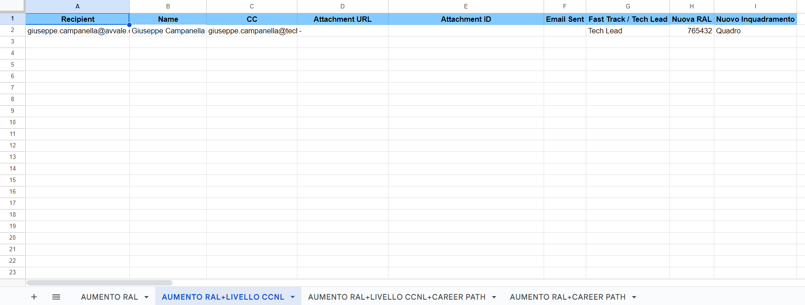

**Generate PDFs from Google Sheet and Google Docs Templates and then send these PDFs as email attachments**

Steps:
* Create a Google Cloud Spreadsheet
* Click Extensions -> Apps Script
* Create as many *.gs files you find inside this folder
* Copy the tabs and columns you find inside the spreadsheet.xlsx file in the Google Cloud Spreadhseet

Base Spreadsheet file:
